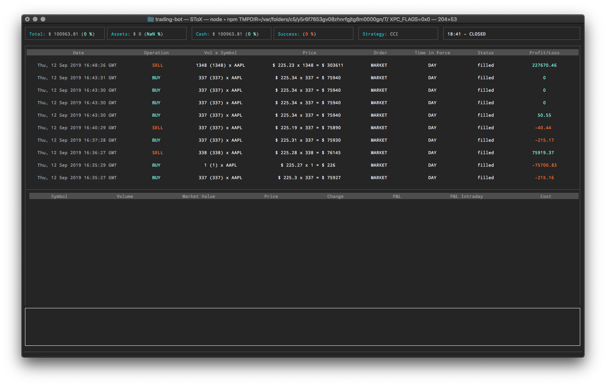

# Trading Bot

This project is an effort to automatize day trading using specific strategies based on technical indicators.

## Requirements

To run this project you will need to have:

- An account on the [IEX Cloud platform](https://iexcloud.io/)
- An [Alpaca](https://app.alpaca.markets) trading account

## Installation

The first step is to create a proper config. You will need to open `src/constants.ts` and replace the following constants with the ones corresponding to your project:

- `IEX_CLOUD_PRIVATE_TOKEN`
- `ALPACA_KEY_ID`
- `ALPACA_KEY_SECRET`

Proceed with the installation of all the dependencies by typing `npm install`.

You will then be able to build the project using `npm run build`. You will find the generated code in the _dist_ folder.

To run the project, type `npm start`.

<!-- ## Tests

To run tests, use `npm run test`. -->

## License

Private
